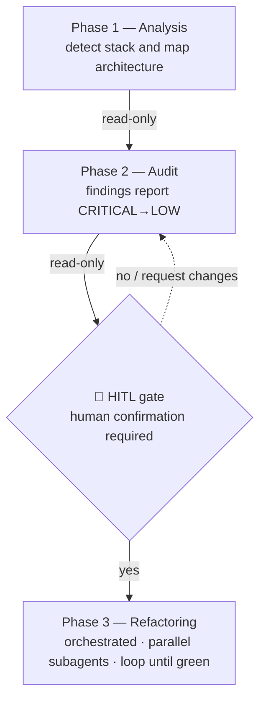
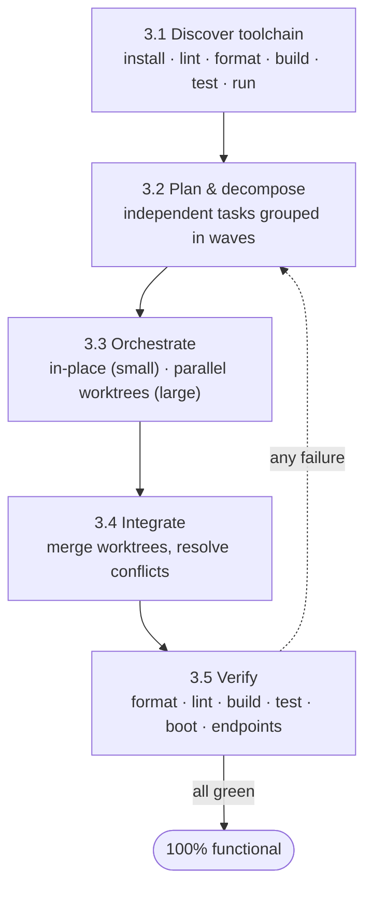

# refactor-arch

Skill that drives the assessment and architectural evolution of a legacy backend as a
**3-phase workflow with human-in-the-loop (HITL)**. Phases 1 and 2 are **read-only** — no
file is modified. Phase 3 (refactoring) only starts after **explicit human confirmation**
of the audit report.

> ⚠️ **Safety:** Phases 1–2 never modify files. Phase 3 only runs after an explicit `y` at
> the [confirmation gate](#-confirmation-gate-hitl) — never before.

## Workflow overview



- **Phases 1–2:** read-only — no file is modified.
- **Gate:** passes only with explicit human approval.
- **Phase 3:** modifies files; happens only after the gate.

**Inviolable principle:** no writing/editing/deleting any target-project file before the
confirmation gate. When in doubt, stop and ask.

## Tooling conventions (run without permission friction)

- **Inspect files with the native tools** — `Read`, `Glob`, `Grep` — never shell `cat`/`ls`/`find`
  for reading. They are pre-authorized and never prompt.
- **When you must shell out, run ONE simple command per call.** Do **not** combine commands with
  `&&`, `||`, `;`, pipes (`|`), subshells `( … )`, redirects (`>`, `2>/dev/null`), or command
  substitution `$( … )`: Claude Code flags compound/complex shell lines for approval **even when
  every part is allow-listed**. Example — to probe the toolchain, issue `python3 -m pytest --version`
  as its own call, not chained with `echo`/`ls`/other checks.
- **Keep the subcommand right after the program; avoid global options like `git -C <path>`.**
  Options placed *between* the program and its subcommand (e.g. `git -C /path ls-files`) defeat
  permission matching, which keys on the `git <subcommand>` prefix — so the call prompts even
  though `git ls-files` is allow-listed. To act on another directory (e.g. a worktree), run the
  command **from that directory's working context** (the worktree subagent already works there),
  not via `-C`. For listing project files, prefer the native `Glob` tool over `git ls-files`.
- **Invoke tools by program name, not by path.** A path-qualified executable (e.g.
  `.venv/bin/pip`, `./node_modules/.bin/eslint`) doesn't match an allow rule keyed on the program
  name (`pip`, `eslint`). Run tools through their launcher so the program name stays stable:
  `uv run <tool>` / `python -m <tool>` (Python), `npx <tool>` (Node). This both satisfies the
  allow-list and avoids depending on a specific venv path.

---

## Phase 1 — Analysis

**Goal:** detect language, framework, database, and map the current architecture.
**Output:** a printed summary. **Modifies nothing.**

### Detection heuristics (agnostic)

| Target | Signals |
|---|---|
| **Language** | `requirements.txt`/`*.py` → Python · `package.json`/`*.js`/`*.ts` → Node · `go.mod` → Go · `Gemfile` → Ruby · `composer.json` → PHP |
| **Framework** | `Flask(__name__)`/`flask==` → Flask · `fastapi`/`APIRouter` → FastAPI · `manage.py`/`settings.py` → Django · `require('express')` → Express |
| **Database** | `sqlite3.connect`/`new sqlite3.Database` → raw SQLite · `flask_sqlalchemy`/`db.Model` → SQLAlchemy · `psycopg2`/`mysql.connector`/`mongoose` → Postgres/MySQL/Mongo · `CREATE TABLE`/`SELECT … FROM` strings → manual SQL |
| **Architecture** | everything in 1 file or 1 "do-it-all" class → monolith/God Class · files split by role but importing each other directly, no service/config → nominal separation · `models/ routes/ services/ utils/` folders + blueprints/DI → partial layering |
| **Entry point / routes** | bootstrap block (`app.run`, `app.listen`, `if __name__ == "__main__"`); counting method+path gives the **route surface** to preserve |

### Steps

1. List source files and dependencies (without running the project).
2. Apply the heuristics above to identify stack and architecture.
3. Map tables/entities and the route surface (method + path).
4. Print the summary in the format:

```
================================
PHASE 1: PROJECT ANALYSIS
================================
Language:      <language>
Framework:     <framework + version>
Persistence:   <database + driver/ORM>
Domain:        <inferred domain>
Architecture:  <summary of current architecture>
Entry point:   <file + how it boots>
Source files:  <N> analyzed (~<LOC> LOC)
DB tables:     <tables>
Endpoints:     <count + highlights>
================================
```

---

## Phase 2 — Audit

**Goal:** cross-reference the code against the anti-pattern catalog and emit a structured
report. **Modifies nothing — the report is shown in the session only; it is not written to disk.**

### Steps

1. For each entry in [`anti-patterns-catalog.md`](./anti-patterns-catalog.md), search for the
   **detection signals** in the code. Record every occurrence with an exact `file:line`.
2. Classify each finding by the catalog **severity** (CRITICAL / HIGH / MEDIUM / LOW) and
   check for **deprecated APIs** (the catalog's own section).
3. Fill the report following the [`audit-report-template.md`](./audit-report-template.md)
   **exactly**: header, summary with counts by severity, findings **ordered CRITICAL → LOW**,
   and the Deprecated APIs section.
4. **Print the report in the session only — do not write any file.** The audit is read-only;
   it leaves no artifact in the project.
5. **Proceed to the gate.**

> The principles catalog [`design-patterns-catalog.md`](./design-patterns-catalog.md)
> (SOLID, DRY, KISS, YAGNI, MVC, Object Calisthenics) is the target ruler: each finding
> should point to which principle the fix moves the code toward.

### Minimum report criteria

- ≥ 5 findings, including ≥ 1 CRITICAL or HIGH.
- Each finding with `file:line` and the template fields (Description, Impact, Recommendation).
- Findings ordered by severity; deprecated in its own section.

---

## 🛑 Confirmation gate (HITL)

When Phase 2 ends, the skill **STOPS**. Before any modification:

1. State explicitly that **no target-project file has been changed** so far.
2. Present the report summary (counts by severity + total).
3. Confirm the audit was read-only and left **no file** in the project, then print the
   confirmation line **exactly** as below, and **wait for the answer**:

```
Phase 2 complete. Proceed with refactoring (Phase 3)? [y/n]
```

4. **Do not proceed** without an explicit `y` (or "yes"/equivalent) from the user. `n`,
   requests for clarification, finding adjustments, or a new audit **do not** count as approval.

---

## Phase 3 — Refactoring (orchestrated, agent-in-the-loop)

**Precondition:** explicit `y` at the gate. Never start otherwise.

**Goal:** restructure the project to MVC, removing the audited anti-patterns, **without
changing behavior** — every original endpoint must still respond. The refactor is split into
tasks, executed by **parallel subagents in isolated git worktrees**, verified against the
project's own toolchain, and **looped until the project is 100% functional**.



### 3.1 Discover the project's toolchain (stack-driven)

Detect the exact commands for **this** stack by inspecting its manifests/config — never assume:
`package.json` scripts, `pyproject.toml`/`setup.cfg`/`tox.ini`, `Makefile`, `README`, CI files
(`.github/workflows/*`), `.pre-commit-config.yaml`, lockfiles. **Read these manifests with
`Read`/`Glob`/`Grep`, and probe tool availability with single atomic commands** (e.g.
`python3 -m pytest --version`) — never chained shell lines (see *Tooling conventions*). Record the
command for each of: **install deps · format · lint · build/compile · test · run/boot**. If a
category is missing, fall back to the language's standard tool, or define a smoke test = boot the
app + hit every endpoint.

Prefer a launcher that keeps environment + invocation self-contained (and the program name
stable for permission matching):
- **Python:** default to **`uv`** — `uv venv`, `uv pip install -r requirements.txt`,
  `uv run <tool>` (it reads `requirements.txt` and PEP 621 `pyproject.toml` regardless of whether
  the project used pip or poetry). If `uv` is unavailable, fall back to `python -m venv` +
  `python -m pip` + `python -m <tool>`. Never invoke tools via `.venv/bin/<tool>` directly.
- **Node:** use the project's package manager (`npm`/`pnpm`/`yarn`) and run binaries via `npx`.
- **Other stacks:** use the ecosystem's own runner (`go`, `make`, …).

### 3.2 Plan & decompose into tasks

From the audit findings and the target MVC layout, build a **task list** sized so tasks are as
**independent as possible** and can run in parallel:

- Prefer **one task per layer/slice** (config, models, repositories, services, controllers,
  routes, middlewares) and/or **per domain/entity**.
- Record **dependencies** (e.g. controllers depend on services) and group tasks into **waves**:
  everything in a wave runs in parallel; dependent tasks go to later waves.
- Track tasks explicitly, each with a clear, verifiable done-criterion.

### 3.2.1 Scale the execution (decide parallelism)

**Match the orchestration cost to the project size — parallel worktrees are not free.** Setting
up a worktree per task plus integration/merge has real overhead that only pays off at scale.
Decide before fanning out:

| Project shape | Strategy |
|---|---|
| **Small / single-domain** (≈ a few hundred LOC, one cohesive module/monolith) | Refactor in a **single in-place pass** — the orchestrator (or one subagent) does it sequentially. **Skip worktrees.** |
| **Large / multi-domain** (many independent entities, or thousands of LOC) | **Fan out**: one subagent per slice/domain in isolated worktrees (3.3), grouped in waves. |

Regardless of strategy, **install dependencies once and reuse** across tasks — never re-install
per worktree.

### 3.3 Orchestrate the refactor (parallel subagents for large projects)

The **main session is always the orchestrator** (subagents cannot spawn their own subagents).
For a **small** project, do the in-place pass and go straight to Verify (3.5). For a **large**
project, dispatch **one subagent per task in its own git worktree** so concurrent edits never
collide:

- Create an isolated worktree per task (`git worktree add`), on its own branch.
- The subagent refactors **only its slice**, following [`refactoring-playbook.md`](./refactoring-playbook.md)
  and the layer responsibilities in [`design-patterns-catalog.md`](./design-patterns-catalog.md);
  it must **preserve the route surface** from Phase 1.
- Run the wave's subagents **concurrently**; wait for the whole wave to finish before the next
  (the wave boundary is the dependency barrier).

### 3.3.1 Cross-cutting best practices (apply during refactor)

Beyond removing the audited anti-patterns, every refactor should leave these in place — stated
**agnostically**; implement them with the project's own stack and only where they don't break
the Phase 1 route surface:

- **Authentication & authorization** — issue a signed, time-bound credential on login and gate
  sensitive / state-changing / admin routes behind an authorization middleware (roles assigned
  server-side, never from the request body). Keep public read endpoints public. See
  [`refactoring-playbook.md`](./refactoring-playbook.md) §13.
- **Pagination** — list endpoints return bounded payloads via a default page size and a hard
  maximum (offset or cursor/keyset). Apply the same defaults across all list endpoints for a
  consistent contract. See [`refactoring-playbook.md`](./refactoring-playbook.md) §14.

### 3.4 Integrate

The orchestrator (not the subagents) merges each worktree back into the working branch,
resolves conflicts, and removes the worktree. Keep changes incremental and reviewable.

### 3.5 Verify against the toolchain

After integrating a wave (and at the end), run the commands discovered in 3.1, in order:

1. install deps → 2. **format** → 3. **lint** → 4. **build/compile** → 5. **test**.
6. **Boot** the app and confirm **every original endpoint responds** (route surface from Phase 1).

Capture every failure with its output.

### 3.6 Loop until 100% functional

If anything fails (format/lint/build/test/boot/endpoint) or any audited anti-pattern remains,
create **fix tasks**, re-dispatch subagents (3.3), integrate, and **re-verify**. Repeat —
agent-in-the-loop — **for as many iterations as needed**. Declare completion only when **all**
hold at once:

- formatter clean · linter clean · build passes · tests pass
- app boots · every original endpoint responds
- no audited anti-pattern remains in the touched code

Then print:

```
================================
PHASE 3: REFACTORING COMPLETE
================================
Structure:   <new MVC layout>
Toolchain:   format ✓ | lint ✓ | build ✓ | test ✓
Validation:  app boots ✓ | endpoints respond ✓ | anti-patterns resolved ✓
================================
```

---

## Reference files

| File | Content | Status |
|---|---|---|
| [`anti-patterns-catalog.md`](./anti-patterns-catalog.md) | Anti-pattern catalog (signals, severity, impact, fix) + deprecated | ✅ |
| [`design-patterns-catalog.md`](./design-patterns-catalog.md) | Target principles: SOLID, DRY, KISS, YAGNI, MVC (layers), Object Calisthenics | ✅ |
| [`audit-report-template.md`](./audit-report-template.md) | Standardized audit report skeleton (Phase 2) | ✅ |
| [`refactoring-playbook.md`](./refactoring-playbook.md) | Before/after transformations mapped to the catalog + MVC target layout (Phase 3) | ✅ |
| *(pending)* detailed analysis heuristics | Dedicated Phase 1 reference (currently summarized inline above) | ⏳ |

> **Self-contained and copyable:** the skill references no paths outside this folder, so it
> can be copied into other projects without changes. Do not assume a specific stack.
