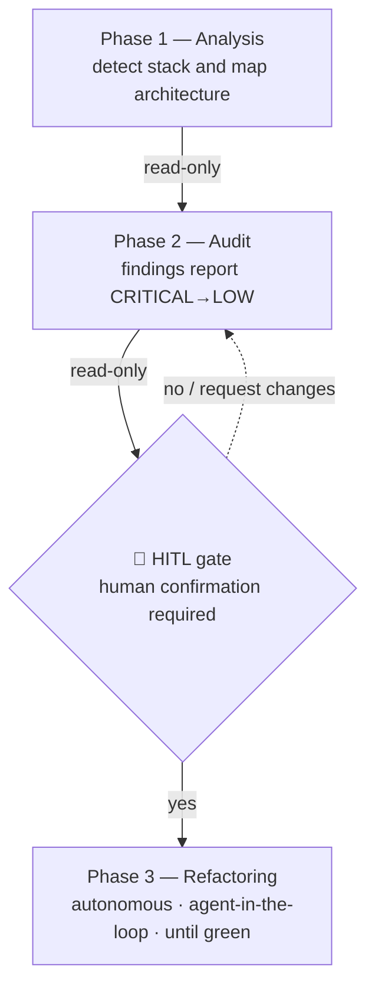
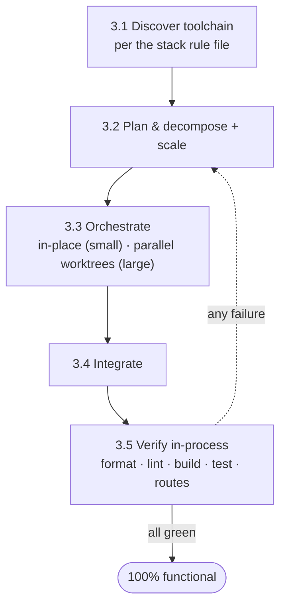

# refactor-arch

Assess and evolve a legacy backend as a **3-phase workflow with one human-in-the-loop (HITL)
checkpoint**. Phases 1–2 are **read-only**; Phase 3 refactors and runs **autonomously** after the
gate. Language- and framework-agnostic: **detect the stack, then consult the matching rule file** —
this document is the map, not the manual.

> ⚠️ **Safety:** Phases 1–2 never modify files. Phase 3 only runs after an explicit `y` at the
> [confirmation gate](#-confirmation-gate-hitl) — never before.

## Workflow overview



## How to use this skill (reference map)

This file orchestrates the phases. Detailed, reusable, and stack-specific knowledge lives beside it
and is read **on demand** — load only what the current step needs:

| When you need… | Read |
|---|---|
| Command shape that won't trigger prompts · in-process verification · safe deletion | [`rules/execution-conventions.md`](./rules/execution-conventions.md) |
| How to install / run / test / verify a specific stack | [`rules/stacks/<stack>.md`](./rules/stacks/) — `node` · `python` · `go` · `ruby` · `php` · `jvm` · `dotnet` |
| Anti-pattern catalog (Phase 2 detection) | [`anti-patterns-catalog.md`](./references/anti-patterns-catalog.md) |
| Target principles (SOLID · DRY · KISS · YAGNI · MVC · Object Calisthenics) | [`design-patterns-catalog.md`](./references/design-patterns-catalog.md) |
| Audit report shape (Phase 2 output) | [`audit-report-template.md`](./references/audit-report-template.md) |
| Before/after transformations (Phase 3) | [`refactoring-playbook.md`](./references/refactoring-playbook.md) |

**Inviolable principle:** never write/edit/delete a target-project file before the gate. When in
doubt **before the gate**, stop and ask. **After** the gate, Phase 3 runs autonomously — resolve
conflicts via its documented policies, never by opening a new prompt.

---

## Phase 1 — Analysis (read-only)

**Goal:** detect language, framework, database; map the current architecture and the **route
surface** (method + path) to preserve. **Modifies nothing.**

| Target | Signals |
|---|---|
| **Language** | `requirements.txt`/`*.py` → Python · `package.json`/`*.ts` → Node · `go.mod` → Go · `Gemfile` → Ruby · `composer.json` → PHP · `pom.xml`/`build.gradle` → JVM · `*.csproj` → .NET |
| **Framework** | `Flask`/`fastapi`/`manage.py` (Python) · `express`/`fastify`/`@nestjs` (Node) · `gin`/`echo` (Go) · `rails`/`sinatra` (Ruby) · `laravel`/`symfony` (PHP) · `spring-boot` (JVM) · `Microsoft.AspNetCore` (.NET) |
| **Database** | raw driver (`sqlite3`, `pg`, `mysql2`, `psycopg2`) vs ORM (`SQLAlchemy`, `Prisma`, `TypeORM`, `ActiveRecord`, `Eloquent`, `Hibernate`, `EF Core`); inline `CREATE TABLE`/`SELECT … FROM` → manual SQL |
| **Architecture** | one file / one "do-it-all" class → monolith/God Class · files split by role but importing each other directly → nominal separation · layered folders + DI → partial layering |
| **Entry point / routes** | bootstrap block (`app.run`, `app.listen`, `main()`); counting method+path gives the **route surface** to preserve |

**Steps:** list source files and deps (native `Read`/`Glob`/`Grep`, never run the project) →
identify stack & architecture → map tables/entities and the route surface → **note which
[`rules/stacks/<stack>.md`](./rules/stacks/) applies** (Phase 3 will use it). Then print:

```
================================
PHASE 1: PROJECT ANALYSIS
================================
Language:      <language>
Framework:     <framework + version>
Persistence:   <database + driver/ORM>
Domain:        <inferred domain>
Architecture:  <summary of current architecture>
Entry point:   <file + how it boots>
Source files:  <N> analyzed (~<LOC> LOC)
DB tables:     <tables>
Endpoints:     <count + highlights>
================================
```

---

## Phase 2 — Audit (read-only)

**Goal:** cross-reference the code against [`anti-patterns-catalog.md`](./references/anti-patterns-catalog.md)
and emit a structured report. **Modifies nothing — the report is shown in the session only; it is
not written to disk.**

**Steps:**
1. For each catalog entry, search the **detection signals**; record every hit with exact
   `file:line`. Check the catalog's **deprecated APIs** section too.
2. Classify each finding by **severity** (CRITICAL / HIGH / MEDIUM / LOW). Point each fix at the
   principle it moves toward ([`design-patterns-catalog.md`](./references/design-patterns-catalog.md)).
3. Fill [`audit-report-template.md`](./references/audit-report-template.md) **exactly**: header, summary by
   severity, findings **ordered CRITICAL → LOW**, deprecated section.
4. **Print the report in the session only — write no file.**
5. **Proceed to the gate.**

**Minimum criteria:** ≥ 5 findings incl. ≥ 1 CRITICAL/HIGH; each with `file:line` + Description,
Impact, Recommendation; ordered by severity.

---

## 🛑 Confirmation gate (HITL)

When Phase 2 ends, the skill **STOPS**. Before any modification:

1. State explicitly that **no target-project file has been changed** so far.
2. Present the report summary (counts by severity + total).
3. Confirm the audit was read-only and left **no file** in the project, then print the confirmation
   line **exactly** as below, and **wait for the answer**:

```
Phase 2 complete. Proceed with refactoring (Phase 3)? [y/n]
```

4. **Do not proceed** without an explicit `y` (or "yes"/equivalent). `n`, clarification requests,
   finding adjustments, or a new audit **do not** count as approval.

---

## Phase 3 — Refactoring (autonomous, agent-in-the-loop)

**Precondition:** explicit `y` at the gate. **Goal:** restructure to MVC, removing the audited
anti-patterns while **preserving the route surface**. Before running commands, read
[`rules/execution-conventions.md`](./rules/execution-conventions.md); for every toolchain command
use the detected [`rules/stacks/<stack>.md`](./rules/stacks/).

> **Phase 3 is autonomous — it never opens a new HITL prompt.** Approving the audit at the gate
> authorizes applying **every** remediation it lists. Resolve conflicts via the policies below.



### 3.0 Security precedence (secure endpoints in place — never drop a route)

**Preserve every original endpoint.** A security finding is fixed by making the route **secure in
place**, never by deleting it. Resolve deterministically — never pause to ask:

| Security finding | In-place fix (route preserved) |
|---|---|
| **SQL injection** — input concatenated into a query | **Parameterized / bound queries**. Same route and contract; input can't alter the SQL. |
| **Endpoint that runs request-supplied SQL/code**, or a **destructive/admin action**, exposed **without access control** | **Authentication + admin authorization** ([`refactoring-playbook.md`](./references/refactoring-playbook.md) §13) so only an authenticated admin reaches it; route keeps responding. Optionally constrain/allow-list the operation without changing its contract. |
| **Other findings** — plaintext passwords, secret/PII exposure, mass-assignment, … | Fix in place per the playbook (salted hashing, output DTOs, allow-lists). Route unchanged. |

Auth-gated routes still **respond** (valid admin credential → normal result; otherwise `401/403`).
**The route surface is never reduced.** Note hardened routes in the completion report.

### 3.1 Discover the toolchain

From the detected [`rules/stacks/<stack>.md`](./rules/stacks/), record the project's commands for
**install · run/stop · test · lint · format · build · in-process verify**. Prefer the project's own
manifest scripts (`package.json`, `Makefile`, etc.) when present; read them with native tools.

### 3.2 Plan, decompose & scale

Build a **task list** sized so tasks are as independent as possible — prefer one task per
layer/slice (config, models, repositories, services, controllers, routes, middlewares) and/or per
domain. Record dependencies and group into **waves** (a wave runs in parallel; dependents go later).
Then match orchestration cost to size:

| Project shape | Strategy |
|---|---|
| **Small / single-domain** (≈ a few hundred LOC, one cohesive module) | **Single in-place pass** — orchestrator or one subagent, sequential. **Skip worktrees.** |
| **Large / multi-domain** (many entities, or thousands of LOC) | **Fan out** — one subagent per slice in isolated worktrees, grouped in waves. |

Install dependencies **once** and reuse across tasks — never per worktree.

### 3.3 Orchestrate

The **main session is always the orchestrator** (subagents cannot spawn subagents). Small project →
in-place, then Verify. Large project → one subagent per task in its own `git worktree` on its own
branch; each refactors **only its slice** following [`refactoring-playbook.md`](./references/refactoring-playbook.md)
and the layer responsibilities in [`design-patterns-catalog.md`](./references/design-patterns-catalog.md), and
**preserves the route surface**. Run a wave concurrently; the wave boundary is the dependency
barrier.

**Cross-cutting best practices** (apply where they don't break the route surface): **auth &
authorization** on sensitive/admin routes (playbook §13) and **pagination** on list endpoints
(playbook §14).

### 3.4 Integrate

The orchestrator (not the subagents) merges each worktree back, resolves conflicts, and removes the
worktree (see deletion guardrail in [`rules/execution-conventions.md`](./rules/execution-conventions.md)).
Keep changes incremental and reviewable.

### 3.5 Verify against the toolchain (in-process)

After integrating a wave (and at the end), run the stack's commands in order: install →
**format** → **lint** → **build/compile** → **test** → **in-process route check** (drive the app
with the framework's test client per the stack file — no real server, no `curl`; auth-gated routes
checked with a valid admin credential). Capture every failure with its output.

### 3.6 Loop until 100% functional

On any failure (format/lint/build/test/route) or remaining anti-pattern, create **fix tasks**,
re-dispatch (3.3), integrate, and re-verify — **for as many iterations as needed**. Declare
completion only when **all** hold:

- formatter clean · linter clean · build passes · tests pass
- app boots · every original endpoint responds (auth-gated with a valid admin credential)
- no audited anti-pattern remains in the touched code

Then print:

```
================================
PHASE 3: REFACTORING COMPLETE
================================
Structure:   <new MVC layout>
Toolchain:   format ✓ | lint ✓ | build ✓ | test ✓
Validation:  app boots ✓ | endpoints respond ✓ | anti-patterns resolved ✓
Security:    all endpoints preserved · vulnerabilities fixed in place (parameterized · auth-gated · hashed)
================================
```

---

## Reference files

| File | Content |
|---|---|
| [`rules/execution-conventions.md`](./rules/execution-conventions.md) | Permission-friendly command shape · in-process verification · deletion guardrail |
| [`rules/stacks/`](./rules/stacks/) | Per-stack ops (install/run/stop/test/lint/verify): `node` · `python` · `go` · `ruby` · `php` · `jvm` · `dotnet` |
| [`anti-patterns-catalog.md`](./references/anti-patterns-catalog.md) | Anti-pattern catalog (signals, severity, impact, fix) + deprecated |
| [`design-patterns-catalog.md`](./references/design-patterns-catalog.md) | Target principles: SOLID, DRY, KISS, YAGNI, MVC (layers), Object Calisthenics |
| [`audit-report-template.md`](./references/audit-report-template.md) | Standardized audit report skeleton (Phase 2) |
| [`refactoring-playbook.md`](./references/refactoring-playbook.md) | Before/after transformations + MVC target layout (Phase 3) |
| [`scripts/safe_remove.py`](./scripts/safe_remove.py) | Guardrailed remover for Phase 3 cleanup inside the target project root only |

> **Self-contained and copyable:** the skill references no paths outside this folder, so it can be
> copied into other projects without changes. Do not assume a specific stack — detect, then read the
> matching rule file.
