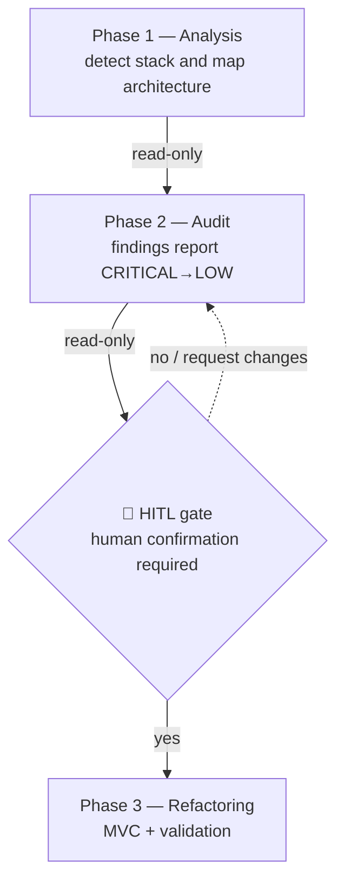

# refactor-arch

Skill that drives the assessment and architectural evolution of a legacy backend as a
**3-phase workflow with human-in-the-loop (HITL)**. Phases 1 and 2 are **read-only** — no
file is modified. Phase 3 (refactoring) only starts after **explicit human confirmation**
of the audit report.

> ⚠️ **Safety:** Phases 1–2 never modify files. Phase 3 only runs after an explicit `y` at
> the [confirmation gate](#-confirmation-gate-hitl) — never before.

## Workflow overview



- **Phases 1–2:** read-only — no file is modified.
- **Gate:** passes only with explicit human approval.
- **Phase 3:** modifies files; happens only after the gate.

**Inviolable principle:** no writing/editing/deleting any target-project file before the
confirmation gate. When in doubt, stop and ask.

---

## Phase 1 — Analysis

**Goal:** detect language, framework, database, and map the current architecture.
**Output:** a printed summary. **Modifies nothing.**

### Detection heuristics (agnostic)

| Target | Signals |
|---|---|
| **Language** | `requirements.txt`/`*.py` → Python · `package.json`/`*.js`/`*.ts` → Node · `go.mod` → Go · `Gemfile` → Ruby · `composer.json` → PHP |
| **Framework** | `Flask(__name__)`/`flask==` → Flask · `fastapi`/`APIRouter` → FastAPI · `manage.py`/`settings.py` → Django · `require('express')` → Express |
| **Database** | `sqlite3.connect`/`new sqlite3.Database` → raw SQLite · `flask_sqlalchemy`/`db.Model` → SQLAlchemy · `psycopg2`/`mysql.connector`/`mongoose` → Postgres/MySQL/Mongo · `CREATE TABLE`/`SELECT … FROM` strings → manual SQL |
| **Architecture** | everything in 1 file or 1 "do-it-all" class → monolith/God Class · files split by role but importing each other directly, no service/config → nominal separation · `models/ routes/ services/ utils/` folders + blueprints/DI → partial layering |
| **Entry point / routes** | bootstrap block (`app.run`, `app.listen`, `if __name__ == "__main__"`); counting method+path gives the **route surface** to preserve |

### Steps

1. List source files and dependencies (without running the project).
2. Apply the heuristics above to identify stack and architecture.
3. Map tables/entities and the route surface (method + path).
4. Print the summary in the format:

```
================================
PHASE 1: PROJECT ANALYSIS
================================
Language:      <language>
Framework:     <framework + version>
Persistence:   <database + driver/ORM>
Domain:        <inferred domain>
Architecture:  <summary of current architecture>
Entry point:   <file + how it boots>
Source files:  <N> analyzed (~<LOC> LOC)
DB tables:     <tables>
Endpoints:     <count + highlights>
================================
```

---

## Phase 2 — Audit

**Goal:** cross-reference the code against the anti-pattern catalog and emit a structured
report. **Modifies nothing.**

### Steps

1. For each entry in [`anti-patterns-catalog.md`](./anti-patterns-catalog.md), search for the
   **detection signals** in the code. Record every occurrence with an exact `file:line`.
2. Classify each finding by the catalog **severity** (CRITICAL / HIGH / MEDIUM / LOW) and
   check for **deprecated APIs** (the catalog's own section).
3. Fill the report following the [`audit-report-template.md`](./audit-report-template.md)
   **exactly**: header, summary with counts by severity, findings **ordered CRITICAL → LOW**,
   and the Deprecated APIs section.
4. Save the report to `reports/audit-project-<N>.md` (create the `reports/` folder if needed).
5. Present the report to the user and **proceed to the gate**.

> The principles catalog [`design-patterns-catalog.md`](./design-patterns-catalog.md)
> (SOLID, DRY, KISS, YAGNI, MVC, Object Calisthenics) is the target ruler: each finding
> should point to which principle the fix moves the code toward.

### Minimum report criteria

- ≥ 5 findings, including ≥ 1 CRITICAL or HIGH.
- Each finding with `file:line` and the template fields (Description, Impact, Recommendation).
- Findings ordered by severity; deprecated in its own section.

---

## 🛑 Confirmation gate (HITL)

When Phase 2 ends, the skill **STOPS**. Before any modification:

1. State explicitly that **no target-project file has been changed** so far.
2. Present the report summary (counts by severity + total).
3. Tell the user the report was saved to `reports/audit-project-<N>.md` (read-only) and print
   the confirmation line **exactly** as below, then **wait for the answer**:

```
Phase 2 complete. Proceed with refactoring (Phase 3)? [y/n]
```

4. **Do not proceed** without an explicit `y` (or "yes"/equivalent) from the user. `n`,
   requests for clarification, finding adjustments, or a new audit **do not** count as approval.

---

## Phase 3 — Refactoring

**Precondition:** explicit `y` at the gate. Never start otherwise.

**Goal:** restructure the project to MVC, removing the audited anti-patterns, **without
changing behavior** — every original endpoint must still respond.

### Steps

1. Plan the target structure using the MVC layout and layer responsibilities in
   [`design-patterns-catalog.md`](./design-patterns-catalog.md). Adapt to the project's stack
   and current state — a partially-layered project is improved in place, not rebuilt from scratch.
2. For each audit finding (CRITICAL → LOW), apply the matching transformation from
   [`refactoring-playbook.md`](./refactoring-playbook.md): move secrets to config, business
   logic to services, data access to repositories, keep controllers thin, centralize error
   handling, and clean the entry point (composition root).
3. **Preserve the route surface** captured in Phase 1: same method + path → same status/shape.
   Refactor incrementally; do not drop or rename endpoints.
4. Update deprecated APIs to their modern equivalents.

### Validation (exit criteria)

Run the project and confirm:

- The app **boots without errors** (the project's start command).
- **Every original endpoint still responds** (same method + path as Phase 1).
- No audited anti-pattern remains in the touched code.

If any check fails, fix and re-validate before declaring completion. Then print:

```
================================
PHASE 3: REFACTORING COMPLETE
================================
Structure:   <new MVC layout>
Validation:  app boots ✓ | endpoints respond ✓ | anti-patterns resolved ✓
================================
```

---

## Reference files

| File | Content | Status |
|---|---|---|
| [`anti-patterns-catalog.md`](./anti-patterns-catalog.md) | Anti-pattern catalog (signals, severity, impact, fix) + deprecated | ✅ |
| [`design-patterns-catalog.md`](./design-patterns-catalog.md) | Target principles: SOLID, DRY, KISS, YAGNI, MVC (layers), Object Calisthenics | ✅ |
| [`audit-report-template.md`](./audit-report-template.md) | Standardized audit report skeleton (Phase 2) | ✅ |
| [`refactoring-playbook.md`](./refactoring-playbook.md) | Before/after transformations mapped to the catalog + MVC target layout (Phase 3) | ✅ |
| *(pending)* detailed analysis heuristics | Dedicated Phase 1 reference (currently summarized inline above) | ⏳ |

> **Self-contained and copyable:** the skill references no paths outside this folder, so it
> can be copied into other projects without changes. Do not assume a specific stack.
